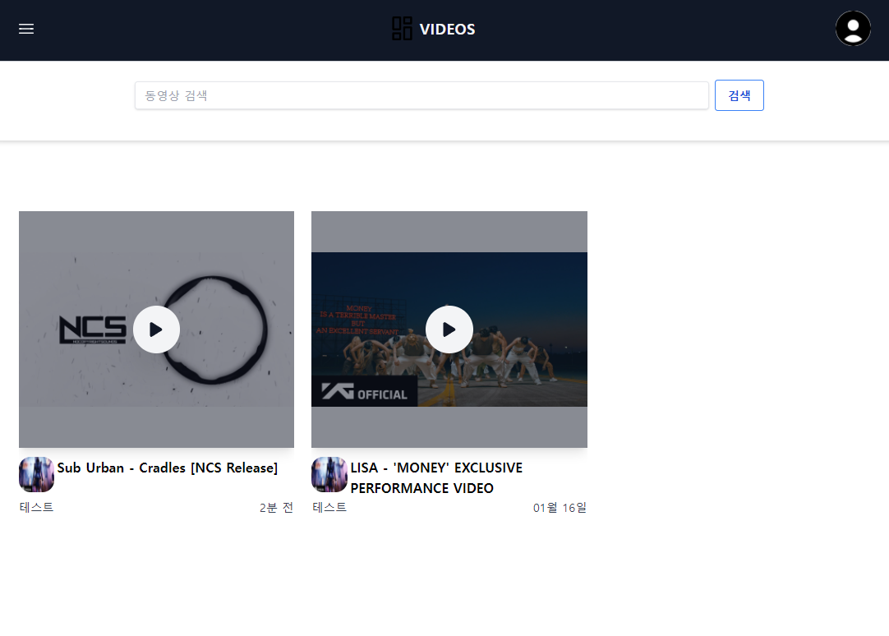
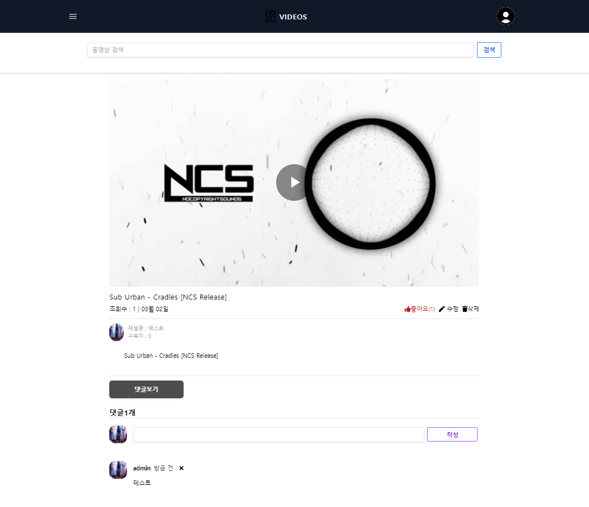
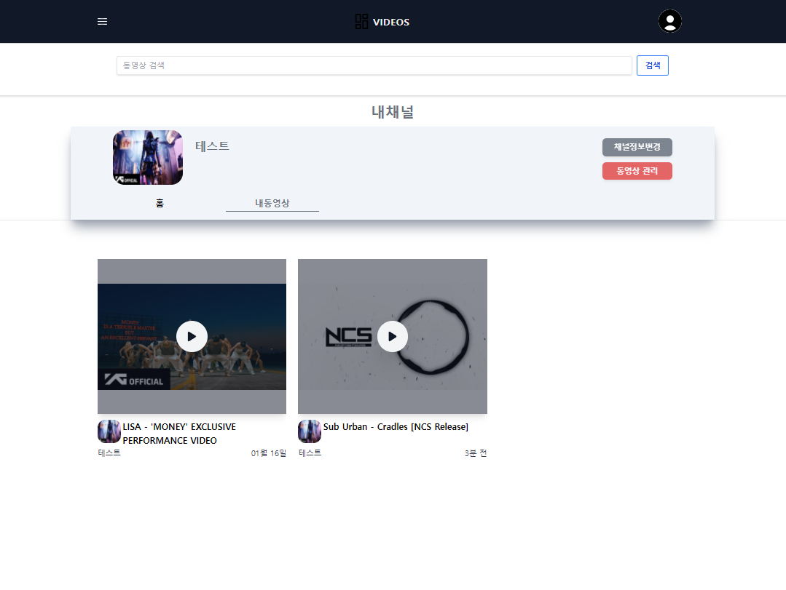
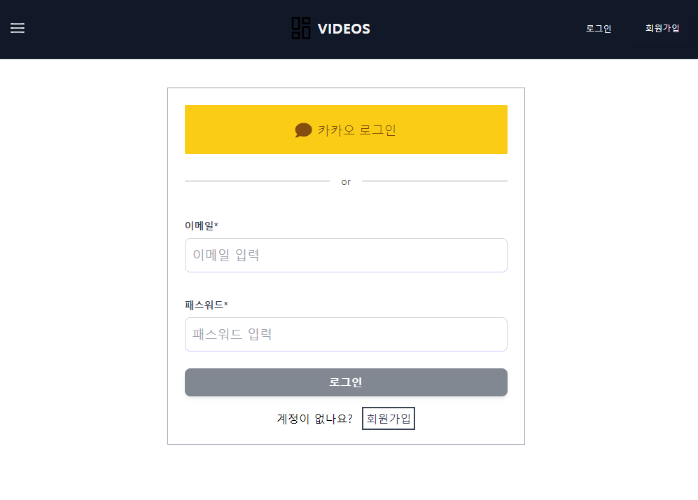
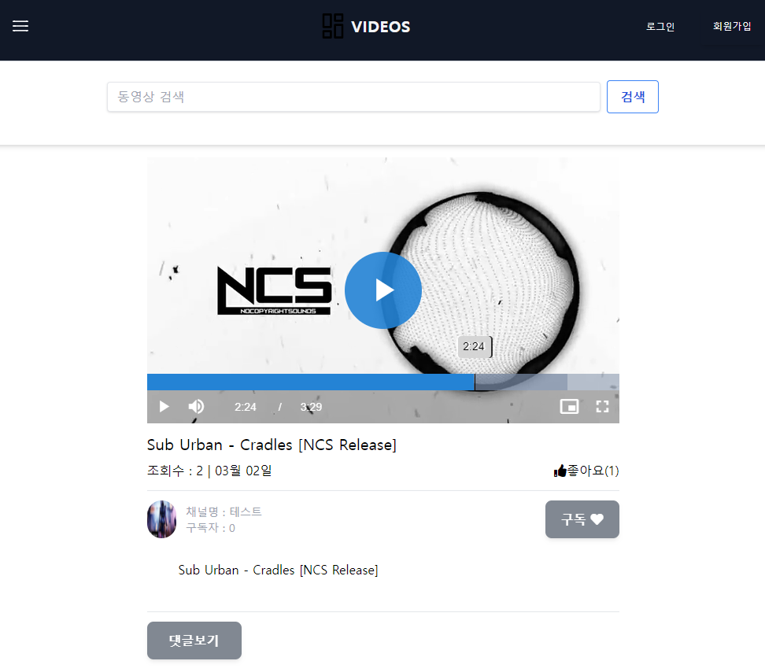

   
<p align="center"></p>
<p align="center"></p>
<p align="center"></p>
<p align="center"></p>
<p align="center"></p>


## django-youtube 비슷하게 만들어 본  사이트

-django<br>
-tailwind.css<br>
-html<br>
-node.js<br>
-axios.js<br>
-alpine.js<br>
-video.js<br>
-postgresql<br>

## 개발서버 테스트시 노드가 설치되어 있어야하고 urlencode 설치되어 있어야함
```
    npm install urlencode
```

## 개발서버 테스트시 개발서버와 영상 스트리밍 서버(node) 두개 켜있어야함
```  
    node stream_server.js
    python manage.py runserver  
``` 
## 배포  
-라즈베리파이<br>
-nginx (node, django)<br>
-Django GUNICORN사용<br>
-node forever사용<br>
###### # node_django_video_stream_-
